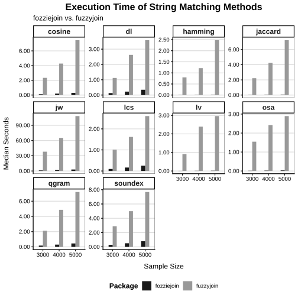
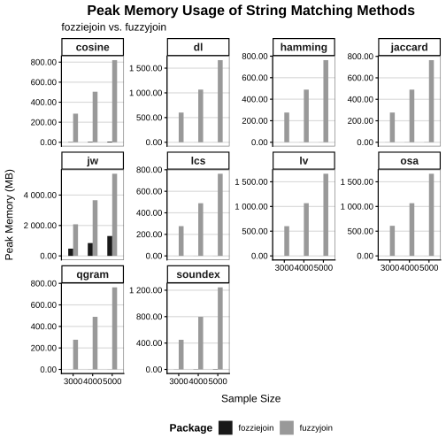
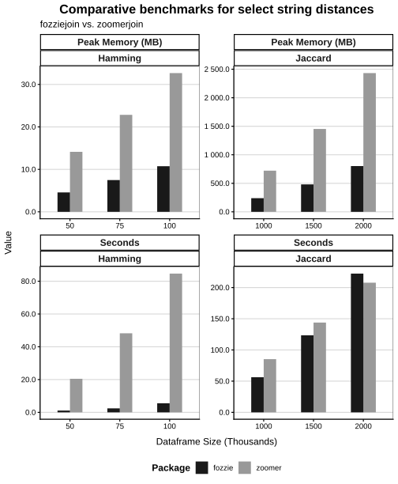

# Introduction

## Introducing `fozziejoin`

- `fozziejoin` is an R library for fuzzy joins that prioritizes speed and memory efficiency
- Version 0.0.13 is available on CRAN
- `fozziejoin` has a Rust backend for better performance

## What is a Fuzzy Join?

- A SQL-like join that matches dataframe rows that have identical or slightly different values
- Fuzzy joins are commonly used for the blocking step in administrative record linkage (e.g. birth $\leftrightarrow$ death registries)

```{r, echo=TRUE}
df1 <- data.frame(name = c('michael'))
df2 <- data.frame(name = c('michelle', 'jim', 'kim', "dominick"))
matches <- fozziejoin::fozzie_string_join(
  df1, df2, method='jaccard', q=2, max_distance=0.6, distance_col='dist'
)
print(matches)
```

## What Join Types Does `fozziejoin` offer?

- `fozzie_string_join`: 10 string distance algorithms
- `fozzie_difference_join`: numeric difference, e.g.  $|a - b|$
- `fozzie_distance_join`: euclidean and manhattan
- `fozzie_interval_join`: discrete or continuous
- `fozzie_regex_join`: regular expressions
- `fozzie_temporal_join`: date/datetime
- `fozzie_temporal_interval_join`: date/datetime intervals

## Other R Packages for Fuzzy Joins

- `fuzzyjoin`- popular, intuitive API, deterministic, many algorithm choices, slow
- `zoomerjoin`- Uses Locality Sensitive Hashing (LSH), fast, probabilistic, needs hyperparameter tuning, limited algorithms

## Why Make `fozziejoin`?

- `fuzzyjoin` scales poorly with size
- `zoomerjoin` is fast, but there are tradeoffs
    - Less distance algorithm availability
    - Requires LSH parameter fine-tuning and familiarity
    - High fixed costs; not necessarily faster
    - Only supports single-column joins
    - Non-deterministic
- `fozziejoin` strives for user friendliness, speed, and deterministic behavior

# How Do `fozziejoin` and `fuzzyjoin`'s Implementations Differ?

## Inner Jaccard Join Example

- Let's compare `fuzzyjoin`'s method to a simplified version of `fozziejoin`'s method

```{r, echo=TRUE}
df1 <- data.frame(name = c('michael'))
df2 <- data.frame(name = c('michelle', 'jim', 'kim', "dominick"))

# Perform joins
fozzie <- fozziejoin::fozzie_string_join(
  df1, df2, method='jaccard', q=2, max_distance=0.6, distance_col='dist'
)
fuzzy <- fuzzyjoin::stringdist_join(
  df1, df2, method='jaccard', q=2, max_dist=0.6, distance_col='dist'
)

# Prove identical
print(all.equal(fozzie, fuzzy))
```

# How `fuzzyjoin` Does Jaccard Joins

## Step 1: Construct Q-grams

- Since `q=2`, create overlapping windows of 2 characters for each word

::: {.two-col}

<div class="left">
<h3 style="text-align: center">Left</h3>
- mi ic ch he ea al
</div>

<div class="right">
<h3 style="text-align: center">Right</h3>

- mi ic ch he el ll le
- ki im
- ji im
- do om mi in ni ic ck
</div>
:::

## Step 2: Calculate Pairwise Distances

- Evaluate $D_J(A, B) = 1 - \frac{|A \cap B|}{|A| + |B| - |A \cap B|}$ for all pairs
- Keep if result is below threshold (0.6)

::: {.one-col}
- 
  <div class="check-unicode">
  <div class="white-box">
  <p class="blue-box">mi</p>
  <p class="yellow-circle">ic</p>
  <p class="red-diamond">ch</p>
  <p class="purple-underline">he</p>
  ea al</div>
  vs.
  <div class="white-box">
  <p class="blue-box">mi</p>
  <p class="yellow-circle">ic</p>
  <p class="red-diamond">ch</p>
  <p class="purple-underline">he</p>
  el ll le</div>
  $= 0.\overline{55}$</div>
- 
  <div class="x-unicode">
  <div class="white-box">mi ic ch he ea al</div>
  vs.
  <div class="white-box">ki im</div>
  $= 1$</div>
- 
  <div class="x-unicode">
  <div class="white-box">mi ic ch he ea al</div>
  vs.
  <div class="white-box">ji im</div>
  $= 1$</div>
-
  <div class="x-unicode">
  <div class="white-box">
  <p class="blue-box">mi</p>
  <p class="yellow-circle">ic</p>
  ch he ea al</div>
  vs.
  <div class="white-box">do om <p class="blue-box">mi</p>
  in ni 
  <p class="yellow-circle">ic</p>
  ck</div>
  $= 0.\overline{81}$</div>

:::

# How `fozziejoin` does Jaccard joins

## Step 1: Reverse Q-Gram Index

- Construct a *reverse q-gram index* for right-hand side
- This reduces the cost of repeated lookups

::: {.two-col}
<div class="left">
<h3 style="text-align: center">Left</h3>
- mi ic ch he ea al
</div>

<div class="right">
<h3 style="text-align: center">Right</h3>
<div class="two-col">
<div class="left" >
<h4 style="text-align: center;"><u>Length = 2</u></h4>
<div style="font-size: 1.2rem;">
- ji: jim
- im: jim, kim
- ki: kim
</div>
</div>
<div class="right">
<h4 style="text-align: center;"><u>Length = 7</u></h4>
<div class="two-col" style="font-size: 1.2rem;">
<div class="left">
- mi: michelle, dominic
- ic: michelle, dominic
- ch: michelle
- he: michelle
- el: michelle
</div>
<div class="right">
  - ll: michelle
  - le: michelle
  - do: dominick
  - om: dominick
  - in: dominick
  - ni: dominick
  - ck: dominick
</div>
</div>
</div>
</div>
</div>
:::


## Step 2: Smart Filtering Strategies

- With `max_distance=0.6` and `q=2`, "michael" must match a word with 3 to 15 bigrams
- Ignore q-grams outside of range

::: {.two-col}
<div class="left">
<h3 style="text-align: center">Left</h3>
- mi ic ch he ea al
</div>

<div class="right">
<h3 style="text-align: center">Right</h3>
<div class="two-col">
<div class="left">
<div class="x-overlay">
<h4 style="text-align: center;"><u>Length = 2</u></h4>
<div style="font-size: 1.2rem;">
- ji: jim
- im: jim, kim
- ki: kim
</div>
</div>
</div>
<div class="right">
<h4 style="text-align: center;"><u>Length = 7</u></h4>
<div class="two-col" style="font-size: 1.2rem;">
<div class="left">
- mi: michelle, dominic
- ic: michelle, dominic
- ch: michelle
- he: michelle
- el: michelle
</div>
<div class="right">
  - ll: michelle
  - le: michelle
  - do: dominick
  - om: dominick
  - in: dominick
  - ni: dominick
  - ck: dominick
</div>
</div>
</div>
</div>
</div>
:::

## Step 3: Q-Gram Lookup

- Look up each bigram in "michael" in our index
- We find 2 hits for "dominick" and 4 hits for "michelle"

::: {.two-col}
<div class="left">
<h3 style="text-align: center">Left</h3>
- <p class="blue-box">mi</p>
  <p class="yellow-circle">ic</p> 
  <p class="red-diamond">ch</p> 
  <p class="purple-underline">he</p> ea al
</div>

<div class="right">
<h3 style="text-align: center">Right</h3>
<h4 style="text-align: center;"><u>Length = 7</u></h4>
<div class="two-col" style="font-size: 1.8rem;">
<div class="left">
- <p class="blue-box">mi</p>: michelle, dominic
- <p class="yellow-circle">ic</p>: michelle, dominic
- <p class="red-diamond">ch</p>: michelle
- <p class="purple-underline">he</p>: michelle
- el: michelle
</div>
<div class="right">
  - ll: michelle
  - le: michelle
  - do: dominick
  - om: dominick
  - in: dominick
  - ni: dominick
  - ck: dominick
</div>
</div>
</div>
:::

## Step 4: Compute Jaccard

- Calculate $D_J(A, B) = 1 - \frac{|A \cap B|}{|A| + |B| - |A \cap B|}$ for each word matching 1+ bigrams
- $D_J(A, B) = 1$ for any words with no matching bigrams
- <div class="check-unicode">"michael" vs. "michelle": $1 - \frac{4}{6+7-4} = 0.\overline{55}$</div>
- <div class="x-unicode">"michael" vs. "dominick": $1 - \frac{2}{6+7-2} = 0.\overline{81}$</div>

## Review 

- `fuzzyjoin` evaluates all pairs; it does not scale well to large dataframes
- `fozziejoin` prunes candidates via smart search strategies and other optimizations
- In practice, `fozziejoin` is almost universally faster and more memory efficient

# Is `fozziejoin` Fast?

```{r}
#| echo: false

# Package Load
library(dplyr)
library(tidyr)

# Load benchmark CSV
benches <- vroom::vroom('./results/fuzzy_fozzie_string.csv')

# Pivot results wide to compare packages at each iteration
pivoted <- benches |>
  pivot_wider(
    id_cols = c(samp_size, method),
    names_from = c(expression),
    values_from = c(median, mem_alloc)
  ) |>
  mutate(
    time_ratio = median_fuzzyjoin / median_fozziejoin,
    memory_ratio   = mem_alloc_fuzzyjoin / mem_alloc_fozziejoin
  )

# Min/max memory for printing
min_mem <- round(min(pivoted$memory_ratio), 1)
max_mem <- round(max(pivoted$memory_ratio), 1)

# Min/max time for printing
min_time <- round(min(pivoted$time_ratio), 1)
max_time <- round(max(pivoted$time_ratio), 1)

# Used sample sizes for printing
samp_sizes <- paste0(unique(pivoted$samp_size), collapse=", ")
```

## `fuzzyjoin` Benchmarks: Methods

- Here, we compare all string distance algorithms available in the current *development version* of `fozziejoin` (0.0.14) and `fuzzyjoin` (0.1.8)
- Data are a random sample of records from the [DIME dataset](https://data.stanford.edu/dime). Inspired by `zoomerjoin` dataset.
- Task: join a subset of records to itself at 3 sample sizes (`r samp_sizes`)
- Benchmarks are repeated 10 times
- Full code/instructions to reproduce these benchmarks are available in the [GitHub repo for this presentation](https://github.com/fozzieverse/cascadia_rconf_2026_presentation)

## `fuzzyjoin` Benchmarks: Time

:::: {.columns}

::: {.column}
- `fozziejoin` is between `r sprintf("%.1f", min_time)` and `r sprintf("%.1f", max_time)` times as fast as `fuzzyjoin`
- Scaling is inconsistent, perhaps dues to differing match rates across sample sizes
:::

::: {.column}

:::

::::

## `fuzzyjoin` Benchmarks: Peak Memory Usage (MB)

:::: {.columns}

::: {.column}
- `fozziejoin` uses `r sprintf("%.1f", min_mem)` and `r sprintf("%.1f", max_mem)` less peak memory than `fuzzyjoin`
- Scaling is again inconsistent
:::

::: {.column}

:::

::::

# Is `fozziejoin` Faster than `zoomerjoin`?

```{r}
#| echo: false

# Package Load
library(dplyr)
library(tidyr)

# Load benchmark CSV
benches <- vroom::vroom('./results/zoomer_fozzie_string.csv')

# Pivot results wide to compare packages at each iteration
pivoted <- benches |>
  pivot_wider(
    id_cols = c(samp_size, method),
    names_from = c(expression),
    values_from = c(median, mem_alloc)
  ) |>
  mutate(
    time_ratio = median_zoomer / median_fozzie,
    memory_ratio   = mem_alloc_zoomer / mem_alloc_fozzie
  )

# Min/max memory for printing
min_mem <- round(min(pivoted$memory_ratio), 1)
max_mem <- round(max(pivoted$memory_ratio), 1)

# Min/max time for printing
min_time <- round(min(pivoted$time_ratio), 1)
max_time <- round(max(pivoted$time_ratio), 1)

# Used sample sizes for printing
samp_sizes_jaccard <- paste0(
  paste0(unique(pivoted[pivoted$method == 'Jaccard', ]$samp_size / 1e6), " mln"),
  collapse = ", "
)
samp_sizes_hamming <- paste0(
  paste0(unique(pivoted[pivoted$method == 'Hamming', ]$samp_size / 1e3), " k"),
  collapse = ", "
)
```

## What about `zoomerjoin`?

- We use much larger sample sizes to benchmark vs. `zoomerjoin` to fit the intended `zoomerjoin` use case (big data)
- We evaluate Jaccard and Hamming string distances with 10 iterations
- For Jaccard distance, we use sample sizes of (`r samp_sizes_jaccard`)
- For Hamming distance, we use sample sizes of (`r samp_sizes_hamming`)

## Notes on `zoomerjoin` Benchmarks

- Due to the nature of LSH, `zoomerjoin` and `fozziejoin` will match differing numbers of records
- LSH join performance is sensitive to hyperparameters
- We experimented with hyperparameters to find a good balance of recall and speed

## `zoomerjoin` vs. `fozziejoin`

:::: {.columns}

::: {.column}
- Jaccard time: `zoomerjoin` is fastest at 2 million records
- Hamming time: `fozziejoin` is faster and scales better in all iterations
- Memory utilization: `zoomerjoin` uses `r min_mem` to `r max_mem` times more memory than `fozziejoin`
:::

::: {.column}

:::

::::

# Closing

## Summary

- `fozziejoin` is a modern alternative to `fuzzyjoin` that prioritizes speed and memory efficiency
- To our knowledge, it's the fastest available option in R for many types of fuzzy joins
- `zoomerjoin` may be a better option with sufficient scale
- Consider trying out our package! If you like it, give us a star on [GitHub](https://github.com/fozzieverse/fozziejoin)!

# Questions?
